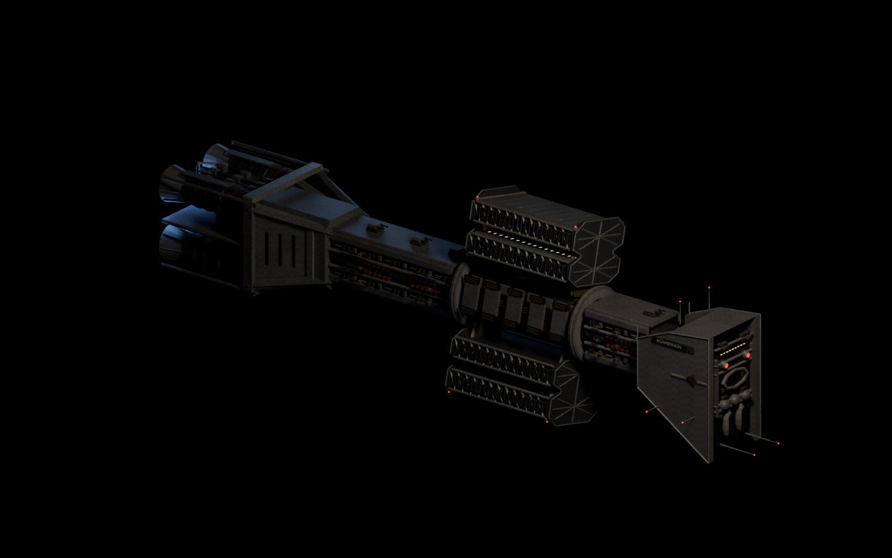

# vkmin

A small Vulkan 1.4 renderer and an audio engine, both in C11, sharing one
deterministic replay format.



## OMEGA — Through the Blue

The demo this is built to run. A procedural destroyer emerges from a blue jump
gate and fires its forward cannons, with a rotating habitat, escorts, custom
shaders, shadows and bloom. Four truss pylons reach from the mouth toward the
camera and charge with red flares; a white flash opens a funnel with a dark
throat; the ship approaches, passes the camera, and the gate closes. Twenty
seconds, with an original 150 BPM score synthesised at runtime by sndmin. The
grade clips highlights and bleeds chroma the way 1990s broadcast CGI did.

```sh
cmake -S . -B build -G Ninja
cmake --build build
./build/omega
```

Any frame can be rendered on its own, headless:

```sh
./build/omega --headless --size 1280 720 --frame 300 --out gate.png
```

That is the whole design in one command — see [Determinism](#determinism).
`--flags` lists every command-line flag and `--cvars` every tunable.

## The two libraries

**vkmin** (`src/vkmin.h`, 352 lines of header over 3966 of implementation) is
the GPU layer: device setup, two device arenas, a persistently mapped host
ring, bindless textures, pipelines, command recording, timestamps and readback.
It has no opinion about your scene. Four platform backends are included — GLFW,
SDL2, SDL3 and Win32 — and exactly one is compiled in.

**sndmin** is the audio engine: voices, a song sequencer and room acoustics. It
builds with no Vulkan and no sound card — the `sndmin` and `sndmin_null`
targets alone need neither.

An optional render layer (`render`) sits on top of vkmin with the frame graph,
shadow views, transparent sorting and the overlay. It is separable, and OMEGA
does not link it.

The source ownership map is in [src/README.md](src/README.md).

## Determinism

Nothing in the render path reads a clock or calls `rand()`. `--frame N` renders
frame N without simulating what came before it, and headless overlays omit
timings for the same reason.

Every call into vkmin after init can be journalled with `--record FILE`, and a
journal replays into a different code path than the one that recorded it. A bug
report is a file; a regression is a journal and a frame number.

```sh
./build/omega --headless --size 1280 720 --frame 300 --record frame300.vkj
```

Replaying is a separate program: `vkmin_replay()` drives the context in place
of the host's own loop, so a binary like OMEGA that runs its own loop asserts
rather than replaying its own journal. The replay driver that used to live in
`examples/` is not currently in the tree, and neither is the test suite that
compared recorded and replayed frames.

## Validation is fatal

Core and synchronization validation are on in debug builds, and the callback
aborts at warning severity. Every object is named, so a message says
`vkmin.cmd[1]` or `vkr.shadow_atlas` rather than a hex handle.

This earned its keep. Synchronization validation found five real defects during
development, all frame-to-frame hazards that no single-frame test can see: a
backbuffer losing its readback copy as a source scope; a draw-count fill racing
the previous frame's indirect read; the same fill racing the previous frame's
count readback; a count readback overwriting its own ring bytes two frames
apart; and a swapchain image read after present. Each fix is a comment at the
barrier it changed.

## Frame inspection

`--events FILE` writes the inspection event log and `--inspect-dir DIR` the
raw attachments, both from the replay path. [inspector/](inspector/) is the
offline viewer for the resulting capture; note that the packager that turned
these outputs into a capture directory it can open is not currently in the
tree.

## Building

Needs a C11 compiler, CMake 3.20, the Vulkan SDK (for `glslangValidator`) and
one of GLFW, SDL2 or SDL3 — or none of them, for the Win32 backend or a
headless build.

```sh
cmake -S . -B build -G Ninja      # RelWithDebInfo, backend auto-detected
cmake --build build
```

| Option | Default | |
| --- | --- | --- |
| `VKMIN_PLATFORM` | `auto` | `glfw`, `sdl2`, `sdl3`, `win32`; `auto` takes the first it finds |
| `VKMIN_HEADLESS` | `OFF` | no window system, no sound card |
| `VKMIN_ANALYZER` | `ON` | GCC's `-fanalyzer` during the normal build |
| `VKMIN_SANITIZE` | `OFF` | ASan + UBSan |

Targets: `omega` (the demo), `vkmin`, `render`, `sndmin`, `sndmin_null`,
`sndmin_miniaudio`, `shaders` (SPIR-V and the generated header) and
`validate-shaders` (`spirv-val` over every module, when it is installed).

Shaders in `src/shaders` compile to SPIR-V and are embedded as `uint32_t`
arrays in a generated `shaders.h` by [cmake/embed_spirv.cmake](cmake/embed_spirv.cmake).
There is no runtime shader compiler and so no file-path failure mode in the
binary.

On Windows the toolchain lives in MSYS2; see the toolchain notes in
[CLAUDE.md](CLAUDE.md).

## Size, deliberately

The build runs at maximum practical warning level with warnings as errors, and
GCC's analyser runs as part of the normal build rather than as an occasional
cleanup. Measured with `wc -l`:

| | lines |
| --- | --- |
| `vkmin.c` | 3966 |
| public header `vkmin.h` | 352 |
| render layer | 1433 |
| sndmin core | 1142 |
| shaders, including shared GLSL | 1864 |
| `omega.c` | 674 |

Code size predicts defects about as well as anything more sophisticated, so
shrinking it is treated as a reliability strategy rather than an aesthetic one.
These were budgets enforced by the test suite; with that suite gone they are
now only measurements.

## License

[MIT](LICENSE).

Vendored under `src/third_party/`, each retaining its own notice: `cgltf` (MIT),
`dr_wav` and `miniaudio` (public domain or MIT-0, at your option), and `stb_image`,
`stb_image_write`, `stb_truetype` and `stb_vorbis` (MIT or public domain, at your
option). All are compatible with the above.

## Known limits

No compute pre-skinning. No light or instance culling for shadow views beyond
frustum tests. No cascade blending at split boundaries. No texture streaming.
No render-target resize — a larger window is upscaled. Instances, lights and
bones are re-uploaded every frame through the host ring rather than living in
device memory; at this scene size that is about 80 KB a frame, and it keeps
ownership obvious.
