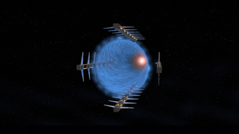
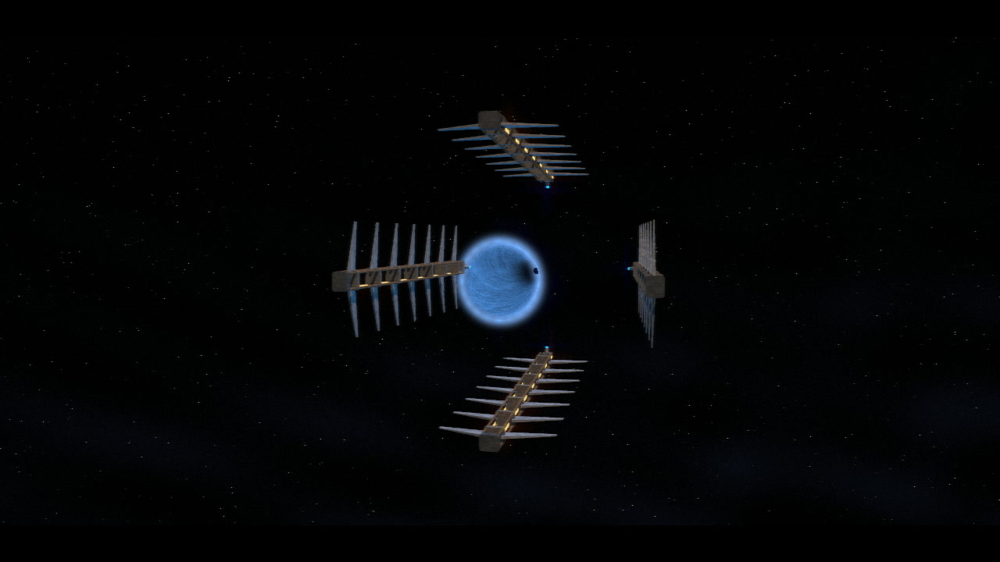
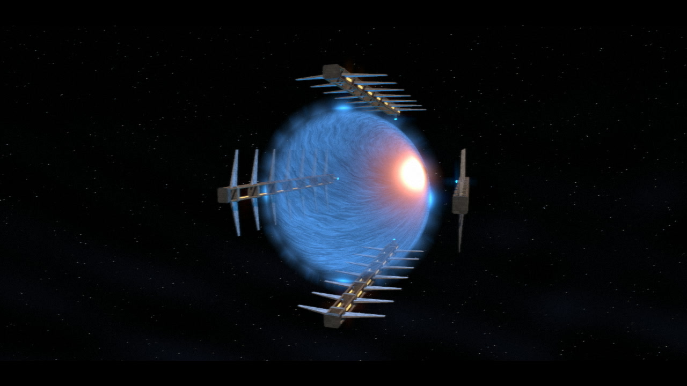
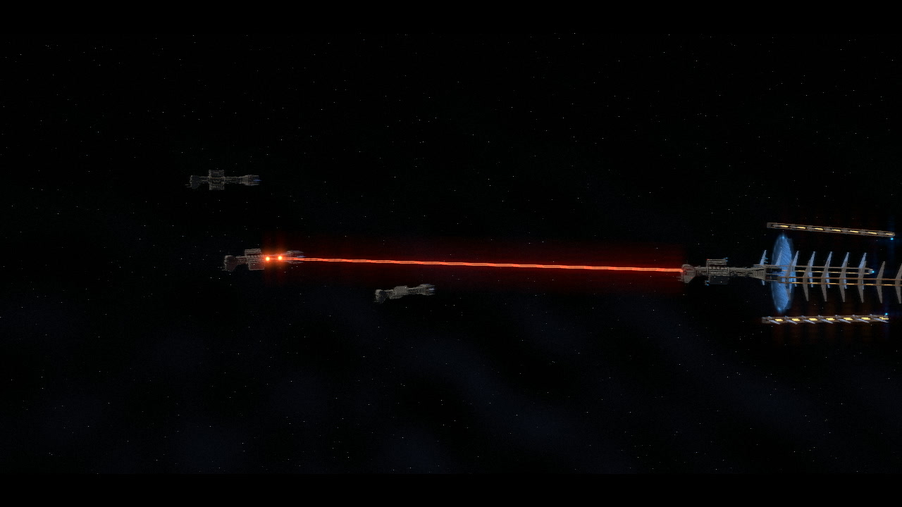
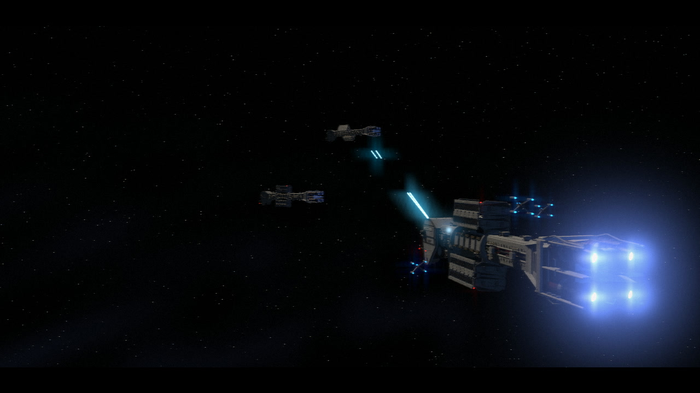
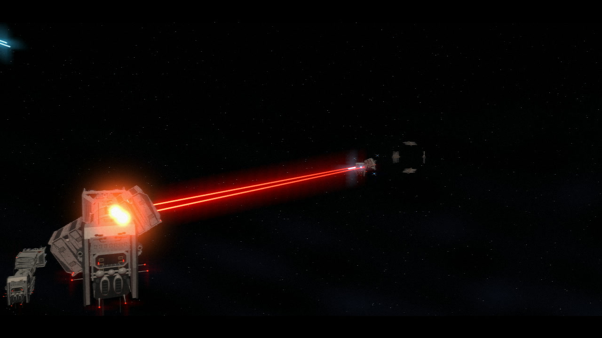
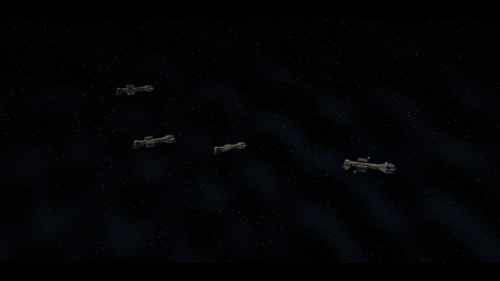
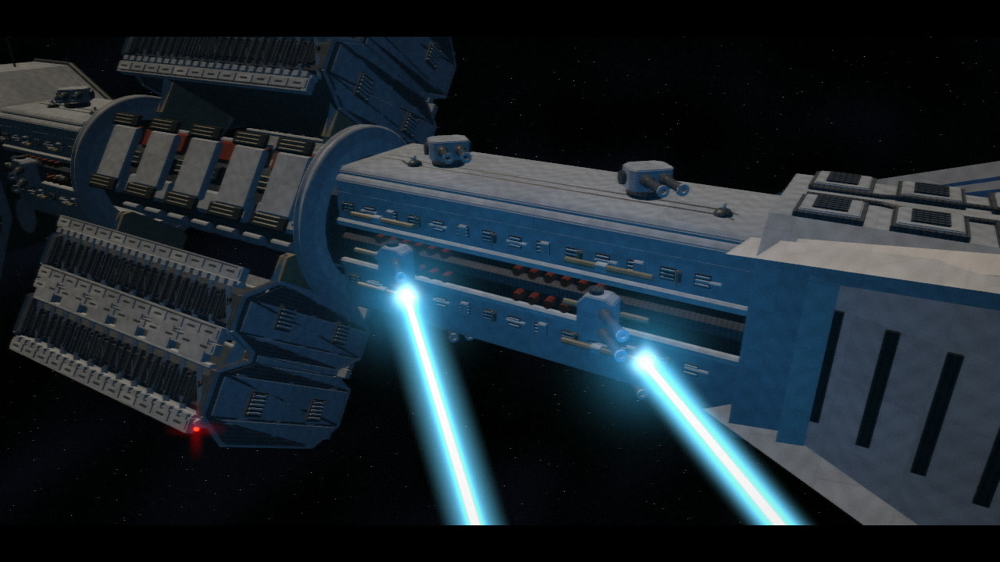
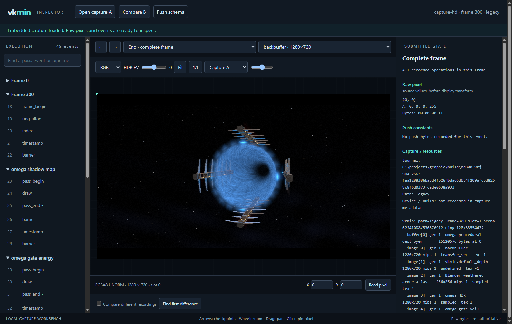
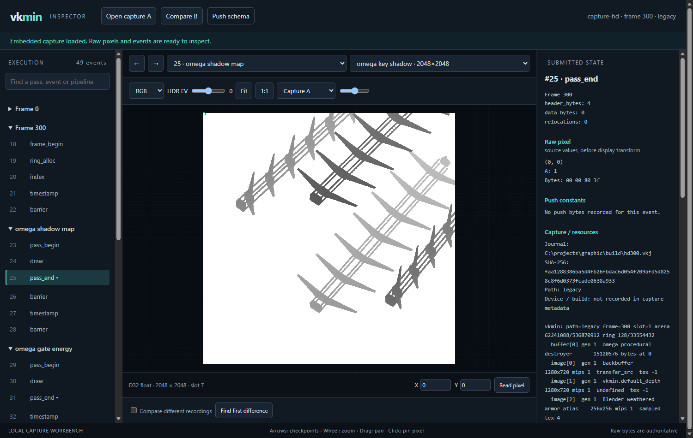

# vkmin

A small Vulkan 1.4 renderer and an audio engine, both in C11, sharing one
deterministic replay format.



Two independent libraries, an optional render layer, a demo that exercises
them, and an offline frame inspector. There is no engine here: nothing owns
your loop, and nothing calls back into your code.

---

## OMEGA — Through the Blue

The demo this is built to run. A Blender-authored destroyer emerges from a blue jump
gate and fires its forward cannons, with a rotating habitat, escorts, custom
shaders, shadows and bloom. Four truss pylons reach from the mouth toward the
camera and charge with red flares; a white flash opens a funnel with a dark
throat; the ship approaches, passes the camera, and the gate closes. Thirty
seconds at 60 Hz, scored by *Iron Across the Blue* at 120 BPM — synthesised at
runtime by sndmin, with no audio files anywhere in the repository. The grade
clips highlights and bleeds chroma the way 1990s broadcast CGI did.

The refined hull has 160,120 triangles, with a recessed launch bay, paired bow
cannons, twelve twin-gun turrets, detailed habitat bearings and deep engine
nozzles. The bow beams start at the modeled bores; secondary turrets traverse
and elevate before firing from alternating barrels. Projectile paths retain
their launch pose, and their flashes and spatial audio share those positions.
Model references and the demo's mechanical assumptions are recorded in
[the model notes](docs/omega-model.md).

```sh
cmake -S . -B build -G Ninja
cmake --build build
./build/omega
```

| | |
|---|---|
|  |  |
| **t = 3 s** — the truss pylons charge, the mouth still dark | **t = 8 s** — the flash opens the funnel and its dark throat |
|  |  |
| **t = 11 s** — the cut to the broadside two-shot | **t = 17 s** — low stern-quarter, engines in the foreground |
|  |  |
| **t = 23 s** — reverse along the lead hull, toward the attacker | **t = 28 s** — the high widening tableau and the final salvo |



The inspection camera (`--weapon-view`) shows the secondary batteries at **t = 13.53 s**.

The whole sequence with its score is
[docs/omega-through-the-blue.mp4](docs/omega-through-the-blue.mp4) — 1280×720
at 60 fps, H.264 and AAC.

Markdown has no video element of its own, and GitHub's renderer treats a raw
`<video>` tag inconsistently, so the animation at the top of this page is a GIF
and the film is a link. Both come from `tools/export_omega_video.py`, which
renders all 1800 frames headless, asks the demo for its own score, and muxes
them with ffmpeg. The demo is deterministic, so that script is a pure function
of the binary: the same build produces the same 1800 frames and the same audio
every time.

Any frame can be rendered on its own, headless:

```sh
./build/omega --headless --size 1280 720 --frame 300 --out gate.png
```

`--flags` lists every command-line flag and `--cvars` every tunable.

---

## The two libraries

### vkmin — the GPU layer

`src/vkmin.h` is 408 lines of header over 4200 of implementation, and the
header is the documentation. Device setup, two device arenas, a persistently
mapped host ring, bindless textures, pipelines, command recording, timestamps
and readback. It has no opinion about your scene.

The shape, in the header's own terms: one context, passed first to everything.
Resources are typed 32-bit handles, zero invalid. A shader reaches a texture by
its bindless index and a buffer by its device address, and both travel in the
push block you define in a header shared with the GLSL — so there is no binding
model, and a draw is a pipeline, a push block and a count. The push block's
size belongs to the pipeline and is checked against the SPIR-V at creation. A
pointer never travels without its size. A frame reads the outside world at
exactly one point: the `vkmin_frame` that `frame_begin` returns.

Every function carries a state contract in its trailing comment — `pure`,
`reads ctx`, `writes ctx`, `gpu`, `io` — so what a call may touch is visible at
the call site. It is single-threaded by design, and failure is fatal rather
than returned: `VKMIN_FAIL` prints file, line and reason, then aborts.

### sndmin — the audio engine

Voices, a song sequencer and room acoustics, in 1142 lines. It needs no Vulkan,
no sound card and no audio files. The API is game-thread only, with no device
or decoder types in it and no callbacks into your code: you begin a frame, then
issue that frame's commands. Zero descriptors select stereo, 48 kHz, unity gain
and pitch.

Two output backends build as separate targets and exactly one links —
`sndmin_null` for headless runs and tests, `sndmin_miniaudio` for a real
device. The engine proper does not know which it got, which is why the whole
score can be rendered to a WAV on a machine with no audio hardware at all.

### render — the optional layer

The frame graph, shadow views, transparent sorting and the overlay, in 1433
lines on top of vkmin. It is genuinely separable, and the honest evidence is
that OMEGA does not link it: the demo drives vkmin directly.

`build/scene` is the program that does link it — a courtyard of cubes and
spheres under one sun with cascades, four orbiting shadowed point lights and a
few transparent billboards, every position a function of the frame index.

```sh
./build/scene --headless --size 1280 720 --frame 300 --out courtyard.png
```

It exists to be recorded and replayed. Until it did, `render.c`, `cull.comp`,
`cluster.comp` and the lit shaders ran nowhere, so the agreement check below
was blind to every line of them. `+d_check_cull 1` additionally compares the
GPU draw list against the CPU reference and reports the mismatch count.

---

## Hardware MSAA

vkmin supports fixed-function MSAA through Vulkan 1.3 dynamic rendering on
both execution paths. Image and pipeline descriptions accept `samples` (zero
means one); `vkmin_sample_counts(ctx, format, usage)` returns the supported
sample-count mask for that format/usage. Intersect the masks for the color and
depth attachments, then choose 1, 2, 4, 8, 16, 32 or 64 from the result.

For a complete target, `vkmin_make_target` performs negotiation, allocation and
resolve wiring. It supports one to three color outputs, optional D32 depth,
and optional resolved depth. The returned `color`, `extra[]` and requested
`depth` outputs are single-sampled; `pass` is a reusable pass descriptor with
clears enabled. Keep the bundle intact and free it between frames with
`vkmin_free_target`, which releases each owned image once.

```c
vkmin_target scene = vkmin_make_target(ctx, &(vkmin_target_desc){
    .width = width, .height = height, .color_format = VKMIN_FMT_RGBA16_FLOAT,
    .depth = true, .samples = 4, .storage = VKMIN_MSAA_PREFER_SINGLE,
    .sampler = VKMIN_SAMPLER_LINEAR_CLAMP, .label = "scene"});
// Set graphics pipeline .samples = scene.samples and .depth = true.
vkmin_pass_begin(ctx, &scene.pass);
// Draw geometry, then end the pass and transition scene.color to SAMPLED.
vkmin_pass_end(ctx);
```

Target `samples = 0` reads `r_msaa`; storage `VKMIN_MSAA_CONFIG` reads
`r_msaa_single`. An explicit storage preference overrides that cvar. The helper
selects the highest common count no greater than requested and falls back to
ordinary attachments when EXT is unavailable. Low-level image and pipeline
counts remain exact. Debug builds enable Khronos validation for pipeline/pass
compatibility and resolve rules. The wrapper checks its own handles, logical
buffer ranges and C/GLSL transport. Targets have fixed dimensions; recreate them
between frames to resize.

Depth attachment presence is independent of color format. Pipeline `depth`
enables testing and declares D32; `depth_attachment` declares D32 without
testing (including for pipelines used in the default backbuffer/depth pass).
Both false means no depth attachment, so fullscreen presentation needs no
dummy depth image. OMEGA and the scene renderer use this depth-free presentation.

A pass specifies `color_resolve`, `extra_resolve[2]` and optionally
`depth_resolve`. Color resolves average samples; R32_UINT resolves sample zero.
Depth supports `SAMPLE_ZERO`, `AVERAGE`, `MIN` and `MAX` where reported by
`vkmin_msaa_capabilities(ctx).depth_resolve_modes`; zero defaults to sample zero
when a depth resolve is present. Resolve images are single-sampled, match the
source format and cover the render area. Source images and pipelines use the
same sample count. Multisampled images have one mip and no direct CPU upload,
readback or combined-sampler registration; use their resolved images for those.

`alpha_to_coverage` on a pipeline enables fixed-function alpha coverage.
Sample shading remains disabled: MSAA needs no extra AA shader or history.

If `vkmin_msaa_capabilities(ctx).render_to_single_sampled` is true, images may
set `render_to_single_sampled=true` with single-sample storage. A pass with
`raster_samples > 1` enables `VK_EXT_multisampled_render_to_single_sampled`;
its pipelines use that raster sample count. These flagged single-sample
attachments resolve implicitly, so leave their explicit resolve handles zero.
The ordinary multisample attachment path remains available on either Vulkan
version. The library never silently changes a requested image/pipeline count.

OMEGA now requests **4x MSAA** for its HDR geometry pass. It resolves before
bloom and grading. Shadow maps and fullscreen effects remain single-sampled.
vkmin prints the requested and selected count, falling back to the highest
supported count no greater than the request. Startup controls:

```sh
./build/omega +r_msaa 1                    # previous single-sample behavior
./build/omega +r_msaa 4                    # default
./build/omega +r_msaa 8
./build/omega +r_msaa 4 +r_msaa_single 1    # prefer EXT; report fallback if absent
./build/omega +r_msaa 4 +r_alpha_to_coverage 1
```

OMEGA's opaque shader outputs normally have alpha 1, so alpha-to-coverage is
exposed for experimentation and is off by default. It does not improve its
procedural shader details. The image arena is now 160 MiB; larger resolutions
or high sample counts may require `+r_image_arena_mb N`.

Version-9 journals preserve explicit pipeline depth attachment declarations,
image samples/flags, pipeline samples/coverage,
and pass resolve targets/modes. Ring pointers are frame-relative so recording
and replay can use different ring sizes. Address fields are now declared explicitly;
an ABI fingerprint rejects incompatible native layouts. Replay still reads versions 3-8
(versions 3-6 multi-frame ring pointers require the original ring-size setting). An EXT
recording requires that extension on the replay device. The inspector shows
sample counts and resolve writes, reads exact resolved pixels and explicitly
marks unresolved multisample storage as unavailable for raw readout. It does
not misrepresent an averaged pixel as an individual sample.

```sh
cmake --build build --target test_msaa replay omega
python tools/check_msaa.py --build build --out NEW_TEST_DIRECTORY
```

Use a Debug build for synchronization validation. The GPU regression exercises
supported sample counts, explicit and helper-created MRT/depth resolves, target
cleanup/fallback, vertex-stage sampling, sparse timestamps, CLI precedence,
wrapper bounds/transport, Khronos rejection in Debug, zero-alpha coverage, and exact
record/replay images on each supported execution path. The optional extension
cases skip explicitly on devices that do not support them.
Use `--require-samples 1 4` and `--require-single` to turn missing coverage into
a failure. The device-free suite also checks negotiation through 64x; this
does not claim that 16x/32x/64x rendering was tested on unavailable hardware.

Journal users must declare address fields with `vkmin_pipeline_desc.push_addresses`,
`vkmin_buffer_desc.addresses`, `vkmin_buffer_upload_typed` and
`vkmin_ring_alloc_typed`. Empty layouts mean plain bytes. The metadata distinguishes
integers from pointers and supports unaligned fields and interior addresses.
Omega and the render layer supply these layouts. See [journal contracts and isolated
replay](docs/replay.md) for migration, compatibility and execution limits.

---

## Platform backends

Four backends implement one 31-line boundary, `src/vkmin_plat.h`. Exactly one
compiles into a binary. They are kept as parallel implementations rather than
alternatives on paper — all four keep building, so switching is one word and
the comparison stays honest.

| Backend | Lines | Needs | |
|---|---|---|---|
| `win32` | 333 | nothing | The window is user32, which mingw and MSVC link by default; XInput is loaded by name at runtime. The no-dependency path. |
| `sdl3` | 213 | SDL3 | |
| `sdl2` | 211 | SDL2 | |
| `glfw` | 99 | GLFW | The smallest, because GLFW already does most of it. |
| none | — | nothing | `-DVKMIN_HEADLESS=ON` compiles no backend and defines `VKMIN_NO_PLATFORM`. |

The two SDL backends share `vkmin_plat_sdl.h`, 109 lines of scancode and
gamepad-button tables — the part where one wrong entry silently drops a key.

Two integration details the build handles so you do not have to. SDL2 ships
`-Dmain=SDL_main` and `-lSDL2main`, which would hijack vkmin's own `main()`;
the backend defines `SDL_MAIN_HANDLED` and calls `SDL_SetMainReady` instead,
and the build filters both out. Both SDL packages also advertise `-mwindows`,
which would detach the console vkmin prints its device and statistics lines to,
so the build consumes only their compiler flags and libraries, never their link
flags.

`-DVKMIN_PLATFORM=auto` is the default and takes the first backend it finds.

---

## C11, deliberately

`-std=c11`, not `-std=gnu11`, everywhere — including the build itself. No C++
anywhere in the tree, and no generated C except `shaders.h`.

This is not nostalgia. The API shape depends on C11 specifically:

- **Compound literals and designated initialisers are the API.** Everything
  configurable takes a `desc` struct in which a zero field is the sensible
  default, so a call site reads as named arguments:
  `vkmin_make_pipeline(gpu, &(vkmin_pipeline_desc){.vs = ..., .label = "..."})`.
  The tree holds 99 such compound literals and about 1860 designated
  initialisers. In C89 this would be a builder API or a pile of `_ex` variants.
- **`_Static_assert` pins the C/GLSL transport contract.** 31 of them hold
  struct sizes to what the shaders and file formats expect — `sizeof(Push) <=
  VKMIN_PUSH_BYTES`, `sizeof(Vertex) == 24`, `sizeof(vkm_header) == 160` — so a
  std140/std430 padding surprise is a compile error rather than a corrupted
  draw.
- **C11 threading, not the platform's.** sndmin passes commands and snapshots
  between the game thread and the audio callback through `_Atomic` ring
  indices, and its reentrancy guard is `_Thread_local`. `<threads.h>` supplies
  `thrd_sleep`. No pthreads, no Win32 threading, no third-party abstraction.

The build runs at maximum practical warning level with warnings as errors, and
GCC's `-fanalyzer` runs as part of the normal build rather than as an
occasional cleanup. Third-party code is quarantined in its own translation
units, compiled with neither our warning set nor the analyser, because mixing
it in is how `-Werror` gets disabled for everything.

---

## Determinism

Nothing in the render path reads a clock or calls `rand()`. `--frame N` renders
frame N without simulating what came before it, and headless overlays omit
timings for the same reason.

Every call into vkmin after init can be journalled, and the journal carries
everything: the recording program is not needed to play it back, nor its
shaders, nor its assets. A bug report is a file; a regression is a journal and
a frame number.

```sh
./build/omega  --headless --size 1280 720 --frame 300 --record f300.vkj
./build/replay --replay f300.vkj --frame 300 --path=legacy --out replayed.png
```

`replay` is a separate program because a replaying context is driven by
`vkmin_replay()` in place of the host's own loop. The second command is the
check that matters: recorded on the modern path, replayed on the legacy one,
and the two PNGs must be byte-identical.

---

## The inspector

`inspector/` is an offline capture workbench — no server, no network, no
dependencies. Record a journal, then let `tools/inspect_frame.py` replay it
once per checkpoint, each from a fresh replay so all history is preserved:

```sh
./build/omega --headless --size 1280 720 --frame 300 --record f300.vkj
python tools/inspect_frame.py f300.vkj --replay build/replay \
    --frame 300 --passes --out capture300 --workbench
```



`--passes` takes one checkpoint per render pass, so the capture above holds
OMEGA's shadow map, gate energy, HDR scene, glow and presentation passes as
well as the complete frame. The tree on the left is the journal itself; dots
mark the events actually captured.



Selecting the shadow-map checkpoint shows its 2048×2048 D32 depth attachment.
Raw attachments are kept exactly as read back and every readout comes from
those bytes — the PNGs beside them are previews, and the panel says so. Here
the pixel at the origin reads `00 00 80 3f`, which is `1.0f`: the far plane,
untouched by any caster.

Nothing here needs a server. `--workbench` writes a single `inspector.html`
with the stylesheet, both scripts and the capture inlined, so it opens straight
from the filesystem. For a viewer that opens *any* capture through the
directory picker instead, build it once — around 30 KB, no external reference
and no request:

```sh
python tools/build_inspector.py --viewer-only --out vkmin-inspector.html
```

`python -m unittest discover -s tools -p test_inspector.py` checks the packager
and the viewer's decoder. It needs Node, but no GPU and no browser.

---

## Validation is fatal

Core and synchronization validation are on in debug builds, and the callback
aborts at warning severity. Every object is named, so a message says
`vkmin.cmd[1]` or `vkr.shadow_atlas` rather than a hex handle.

This earned its keep. Synchronization validation found five real defects during
development, all frame-to-frame hazards that no single-frame test can see: a
backbuffer losing its readback copy as a source scope; a draw-count fill racing
the previous frame's indirect read; the same fill racing the previous frame's
count readback; a count readback overwriting its own ring bytes two frames
apart; and a swapchain image read after present. Each fix is a comment at the
barrier it changed.

---

## Building

Needs a C11 compiler, CMake 3.20, the Vulkan SDK for `glslangValidator`, and
one of GLFW, SDL2 or SDL3 — or none of them, for the Win32 backend or a
headless build.

```sh
cmake -S . -B build -G Ninja      # RelWithDebInfo, backend auto-detected
cmake --build build
```

| Option | Default | |
| --- | --- | --- |
| `VKMIN_PLATFORM` | `auto` | `glfw`, `sdl2`, `sdl3`, `win32`; `auto` takes the first it finds |
| `VKMIN_HEADLESS` | `OFF` | no window system, no sound card |
| `VKMIN_ANALYZER` | `ON` | GCC's `-fanalyzer` during the normal build |
| `VKMIN_SANITIZE` | `OFF` | ASan + UBSan |

Targets: `omega`, `scene`, `replay`, `vkmin`, `render`, `sndmin`, `sndmin_null`,
`sndmin_miniaudio`, `shaders` and `validate-shaders`.

Shaders in `src/shaders` compile to SPIR-V and are embedded as `uint32_t`
arrays in a generated `shaders.h` by
[cmake/embed_spirv.cmake](cmake/embed_spirv.cmake). There is no runtime shader
compiler and so no file-path failure mode in the binary.

On Windows the toolchain lives in MSYS2; see the notes in [CLAUDE.md](CLAUDE.md).

---

## Size, deliberately

Code size predicts defects about as well as anything more sophisticated, so
shrinking it is treated as a reliability strategy rather than an aesthetic one.

`python tools/sizes.py` reports it and `--check` fails when a group is over
budget; CI runs the latter, so these are gates rather than intentions. It
counts **code** — comments and blanks stripped — because a budget measured in
raw lines charges you for explaining the code, and a documentation pass then
reads as growth. The stripper agrees with `gcc -fpreprocessed -dD -E -P` to
within a line on every file in the tree.

| | code | budget |
| --- | --- | --- |
| vkmin core (`vkmin.c`, cvar, stb) | 3815 | 4200 |
| public header `vkmin.h` | 272 | 300 |
| gpu headers | 601 | 900 |
| common (`min_*`) | 347 | 700 |
| platform boundary and all four backends | 828 | 1100 |
| render layer | 1252 | 2600 |
| render headers | 433 | 1000 |
| sndmin | 1110 | 2200 |
| sndmin headers | 267 | 900 |
| shaders, including shared GLSL | 1635 | 2000 |
| demos (Omega, its weapon/shared headers, scene and kit) | 1226 | 1400 |

Generated and vendored code — the baked font, the model arrays,
`src/third_party` — is measured but never budgeted; it is not ours to shrink.

Raising a budget deliberately is fine. Passing one without noticing is what
the check exists to prevent, which is why the number and the code that needs
it should move in the same commit.

## License

[MIT](LICENSE).

Vendored under `src/third_party/`, each retaining its own notice: `cgltf` (MIT),
`dr_wav` and `miniaudio` (public domain or MIT-0, at your option), and `stb_image`,
`stb_image_write`, `stb_truetype` and `stb_vorbis` (MIT or public domain, at your
option). All are compatible with the above.

## Known limits

No compute pre-skinning. No light or instance culling for shadow views beyond
frustum tests. No cascade blending at split boundaries. No texture streaming.
No render-target resize — a larger window is upscaled. Instances, lights and
bones are re-uploaded every frame through the host ring rather than living in
device memory; at this scene size that is about 80 KB a frame, and it keeps
ownership obvious.
