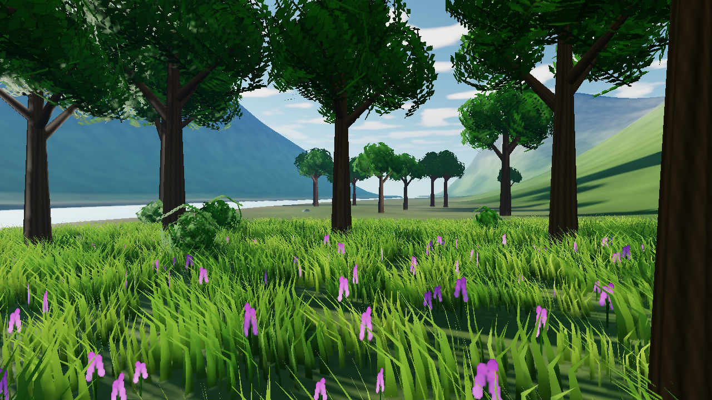

# v0.5 outside — implementation, visual pass and measured limits

The outdoor primitives and valley are implemented. The visual pass responds to
the supplied Eden screenshots with denser ground cover, twig-shaped leaf cards,
shrubs, flower patches, bark, stronger lighting variation and softer transitions.
**This is progress toward that visual target, not a claim of matching Eden or
of inventing a new rendering algorithm.** Tree diversity, distant vegetation and
motion reconstruction still limit the result.

The isolated release is based on v0.4 commit `81b83ac`. Concurrent audio work in
the original checkout was preserved and excluded from this graphics commit.
The completed fresh-directory Windows/lavapipe run reported **108 checks,
6 failures**. All **28 outdoor checks passed**. The six historical Corridor
comparisons remain a release acceptance blocker; their goldens were not changed.
The final rerun also completed with 108 checks and the same six failures; it
covers the corrected profile density and revised water textures.



## Rendering and assets

- Terrain uses an 85-node quadtree, four detail levels, skirts and conservative
  instance bounds. The existing culler handles selected chunks. Four albedo and
  normal maps blend through a splat map in world coordinates. The map covers
  1536×1536 metres. Pure normal/flow functions allocate nothing and use one-sided
  derivatives on borders; flat terrain returns zero downhill flow.
- GPU scatter uses frame-independent integer cell hashes for placement, scale
  and rotation, with fixed output slots. It regenerates from density maps every
  frame. There is no CPU placement list. Grass, flowers, rocks, trees and shrubs
  use the same compute path.
- Grass uses five triangles per blade. The normal path groups 48 blades with
  different positions, orientations and heights into each patch mesh. Shared
  wind, root shading, pigment variation, distance density and shrinking into
  terrain apply in the existing vertex/fragment shaders. Alpha-tested depth and
  shadow rendering use the same deformation. `r_grass_patch=0` keeps a simpler,
  lower-density single-blade reference for quality/cost comparisons.
- Trees use one trunk and one leaf mesh, with 288 small twig sprays instead of
  large crossed circles. Shrubs reuse the leaf shader. Eight impostor views are
  baked from the same tree geometry and rendered through the billboard batcher.
  Dithered coverage crossfades over 50–60% of scatter distance. Meshes continue
  casting shadows beyond the camera impostor transition. Masked mip generation
  preserves alpha coverage; authored leaf, flower, bark and atlas colour uses
  sRGB sampling.
- Sky uses Rayleigh and Henyey–Greenstein Mie approximations, an analytic sun
  disc, hemisphere ambient and aerial perspective. A distant planar cloud layer
  uses the same moving mask as cloud shadows; no volume marching is involved.
  Sky reflection in water includes that layer. All weather is indexed by frame.
  The final shadow cascade fades by distance rather than ending abruptly.
- Water analytically intersects a bounded flat plane in a fullscreen pass.
  Completed scene colour/depth drive refraction, absorption, bank foam and
  transparency. Two normal textures use two-phase flow advection. Smooth noise
  slopes replace the earlier visibly repeated sine-wave grid. Fresnel uses sky
  reflection. The shader writes a separate target, never its sampled attachment.
- Post processing provides separable bloom, fixed exposure and TAA with a
  frame-indexed 16-sample Halton sequence. Camera reprojection, depth rejection
  and neighbourhood clamping reject history; discontinuities invalidate it.
  Ping-pong history is independent of the GPU frame slot.
- Eight camera keys describe a two-minute route. The accelerated 07:00–10:00
  morning, route, patch mesh recipe and original artwork are demo choices.
  Assets are committed images and `scene.txt`; optional `tools/bake_valley.py`
  runs offline and is not required by the demo or tests.

Outdoor resource allocation is opt-in. Draw storage uses the caller's capacity,
up to 16,384 instances, rather than imposing the outdoor allocation on older
examples. Scatter requires GPU culling and does not support the CPU cull oracle.
The forward vertex shader now rejects the other material group before fetching
vertices or evaluating wind, avoiding duplicate work across opaque/grass passes.
Timestamp pairs measure scatter, grass colour, sky, water and TAA separately.

## Performance measured on this machine

Intel(R) Graphics, Windows driver **32.0.101.8132**, Vulkan modern path,
1280×720, 4096 shadow atlas, bloom enabled, overlay disabled. Three interleaved
trials per mode, 64 consecutive frames per trial, 56 delayed GPU timestamp
samples after warm-up. **No PNG capture between frames.** The table gives the
median trial mean in milliseconds; raw data is in [valley-profile.json](valley-profile.json).

| Mode | GPU frame | Scatter | Grass colour | Sky | Water | TAA |
| --- | ---: | ---: | ---: | ---: | ---: | ---: |
| Single blade, TAA off | 11.583 | 0.072 | 0.621 | 0.165 | 0.215 | 0.000 |
| Dense patches, TAA off | 12.160 | 0.032 | 1.053 | 0.165 | 0.232 | 0.000 |
| Dense patches, TAA on | 12.449 | 0.032 | 1.051 | 0.164 | 0.230 | 0.339 |

The patch path offers 196,608 candidate blades in 4,096 instances versus 14,400
blades/instances in the reference: **13.65× candidate geometry, 71.6% fewer grass
instance/command slots**. Density/frustum tests reduce what is actually drawn.
It costs about 0.58 ms more per GPU frame in this comparison. This is a denser
scene for modest added cost, not an equivalent-work speedup. Multi-draw API call
count remains unchanged, and stable command arrays still contain inactive slots.
The three TAA trial means span 12.388–12.498 ms, with individual maxima up to
14.939 ms. These are short headless GPU measurements, not presented-frame FPS,
CPU timings, full-route guarantees or a comparison with Eden's different hardware.

An earlier capture-heavy experiment was discarded: writing a PNG every frame
changed submission cadence and produced misleading comparisons. Reproduce the
capture-free comparison from the repository root:

```sh
python tools/profile_valley.py --exe build/ex_20_valley --out build/profile.json
```

## Portability fixes exercised on Intel

Intel exposed two assumptions hidden by lavapipe: host-transfer images can have
different memory-type requirements, and host copies need not support sampled or
transfer-source layouts. Image arena selection now intersects depth, ordinary
colour and host-transfer colour requirements. Supported host layouts are queried;
unsupported transitions use GPU barriers while pixel copies still happen on the
host. `r_host_layouts=0` forces that alternative for testing on lavapipe.
This follows Vulkan's [host-copy memory/layout rules](https://docs.vulkan.org/features/latest/features/proposals/VK_EXT_host_image_copy.html).

Intel legacy and modern paths rendered identical pixels through TAA frame 15 at
640×360 with validation silent. The 1280×720 performance/visual runs also completed
with validation silent. This does not establish pixel identity across GPU vendors.

## Determinism, profile and release checks

`vkmin_desc.history` is set before initialization. With TAA enabled, `--frame N`
evaluates frames 0 through N and prints that warm-up is occurring. With `+taa 0`,
frame N is isolated. History frame lists must be nonnegative and strictly ordered.
The header states this caveat next to its determinism contract.

The lavapipe profile uses 320×180, one terrain level, a 1000-metre far plane,
no bloom/TAA and exactly 1/50 of normal scatter probability for grass. It retains
the same patch geometry, avoiding an accidental additional density reduction.
All four goldens come from the committed journal's legacy replay and are checked
against a live render and modern replay at tolerance zero.

| Frame | Landmark | Intended failure signal |
| --- | --- | --- |
| 0 | Meadow | Grass fade/material boundary |
| 2400 | Shallows | Foam at the bank, absorption with depth |
| 4800 | Trees | Alpha depth ordering, shadows, impostors |
| 7199 | Wide valley | Atmospheric recession |

```sh
make HEADLESS=1 test
mkdir -p shots replay
./build/ex_20_valley --profile=lavapipe --frames 0,2400,4800,7199 --record valley.vkj --out-dir shots
./build/ex_20_valley --profile=lavapipe --frames 0,2400,4800,7199 --path=legacy --replay valley.vkj --out-dir replay
./build/ex_20_valley --headless --frame 63 --timings --out meadow.png
```

Executed: GCC 16.2 warnings-as-errors and `-fanalyzer`, cppcheck, SPIR-V validation,
amalgamation compilation, normal/flow/LOD/jitter/sun pure tests, four journal
landmarks on both Vulkan paths, TAA warm-up/replay/sync-naive equality, disabled-TAA
isolation, forced GPU-layout equality, and existing game/reference checks.
The physical budgets are **8,533 core lines**, including both paths and generated
font data; **1,221 lines across all shaders**; **266 valley C lines**. Tests, asset
bakers and documentation are excluded. The harness enforces the limits.

The six full-suite failures are `corridor_0`, `corridor_120`, `corridor_240`,
`corridor_360`, `overlay` and `debug_3`, matching the v0.4 baseline report.
No claim is made that `make test` exits successfully: it exits nonzero on those
historical comparisons. The five game replays and all outdoor checks pass.

Not established: Eden-level visual parity, a full 7,200-frame TAA replay,
windowed/presentation performance, sanitizer results, Linux CI or broad GPU
coverage. TAA only has camera motion, so foliage can ghost. Tree silhouettes
and terrain/vegetation variety remain limited. The flat cloud layer is visibly
simpler than volumetric clouds. Water reflects the sky; the header notes mirrored-
camera planar scene reflections as the parallel implementation, but it is not
implemented. Camera speed uses spline parameters rather than arc length.

## Reuse by v0.4 games

These are concrete integration candidates, not already-executed integrations.
No renderer primitive is confined to the valley. The route, authored valley
and accelerated morning schedule are labelled demo features in the example.

| Primitive | First reuse | Second reuse |
| --- | --- | --- |
| Terrain LOD and splat materials | `11_rts`: replace the single-resolution battlefield | `10_shooter`: outdoor approach/courtyard terrain |
| Normal/flow map functions | `11_rts`: slope lighting and river directions | `10_shooter`: ground normals and drainage channels |
| Density scatter | `11_rts`: battlefield rocks and vegetation | `10_shooter`: outdoor props and cover |
| Grass and terrain fade | `11_rts`: close-camera ground cover | `10_shooter`: walkable meadow/courtyard fringes |
| Leaf cards and impostors | `11_rts`: large forest groups | `10_shooter`: trees along outdoor sightlines |
| Shared wind | `11_rts`: grass and forest gusts | `14_anime`: stage foliage and cloth-like prop motion |
| Sky and sun parameter | `11_rts`: battlefield daylight | `10_shooter`: courtyard daylight |
| Aerial perspective | `11_rts`: distant battlefield ridges | `10_shooter`: distant outdoor geometry |
| Hemisphere ambient | `11_rts`: outdoor diffuse lighting | `10_shooter`: open-courtyard fill light |
| Cloud shadows | `11_rts`: weather over ground cover | `10_shooter`: moving courtyard shade |
| Flowing water | `11_rts`: river crossings | `10_shooter`: shallow channels and pools |
| Bloom | `10_shooter`: bright effects and glints | `14_anime`: highlights and emissive stage props |
| Temporal AA | `10_shooter`: moving camera and thin geometry | `11_rts`: dense distant vegetation |

Custom/cel fragment shaders compose the exported weather helpers explicitly;
the canonical PBR shader has the outdoor surface/lighting integration already.
